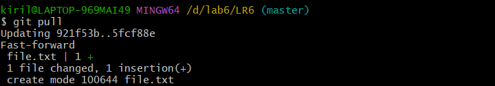
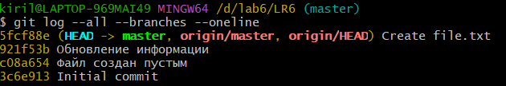
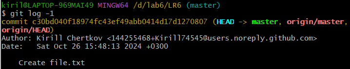
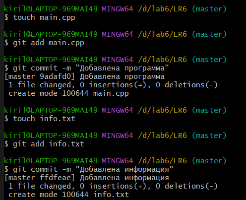
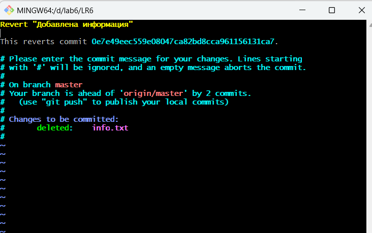
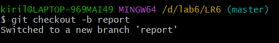

# LR6
Лабораторная работа №6

# Отчет по работе с Git

## 1. Создание аккаунта на сайте GitHub 
[Официальный сайт GitHub](https://github.com/)

## 2. Создание форка
*Скриншот с созданием форка*  


## 3. Установка Git
[Установка Git](https://git-scm.com/)

## 4. Изменение имени пользователя
Команда для изменения имени пользователя:

```bash
$ git config --global user.name "Kirill Chertkov"
```

## 5. Клонирование репозитория

```bash
$ git clone https://github.com/Antochhka/LR6
```
*Скриншот с клонированием репозитория*  


## 6. Добавление нового файла, подтягивание изменений в локальный репозиторий
*Скриншот с добавлением нового файла*


```bash
$ git pull
```
*Скриншот с подтягиванием изменений в локальный репозиторий*


## 7. Получение данных для каждой из веток

```bash
$ git log --all –oneline
```

*Результат работы команды*


## 8. Просмотр последних изменений

```bash
$ git log -1
```

*Результат работы команды*


## 9. Решение конфликта и слияние веток

```bash
$ git checkout master
$ git merge branch1
```
*Слияние веток*


## 10. Удаление побочной ветки после слияния

```bash
$ git branch -d branch1
```

*Удаление побочной ветки*


## 11. Изменения, коммитация изменений
```bash
$ git add .
$ git commit -m 'Изменения'
```
*Коммитация изменений*



## 12. Откат коммита

```bash
$ git reset HEAD
```

*Откат коммита*



## 13. Создание ветки для отчета

```bash
$ git checkout -b report
```

*Создание ветки*


## 14. Получение истории операций в форматированном виде

```bash
$ git log --pretty=format:"%h %ad %an %s" --date=short
```

## 15. История операций
Список истории операций:
+ e15bf7d 2024-10-26 Kirill Chertkov Попытка исправить прикрепление фотографий к отчёту
+ 483bae5 2024-10-26 Kirill Chertkov Написание отчета
+ db607c0 2024-10-26 Kirill Chertkov Добавлена папка со скриншотами
+ 2ee3405 2024-10-26 Kirill Chertkov Revert "Добавлена информация"
+ ffdfeae 2024-10-26 Kirill Chertkov Добавлена информация
+ 9adafd0 2024-10-26 Kirill Chertkov Добавлена программа
+ c30bd04 2024-10-26 Kirill Chertkov Create file.txt
+ 921f53b 2020-11-21 Kurtyanik Обновление информации
+ c08a654 2020-11-21 Kurtyanik Файл создан пустым
+ 3c6e913 2020-11-21 Kurtyanik Initial commit


