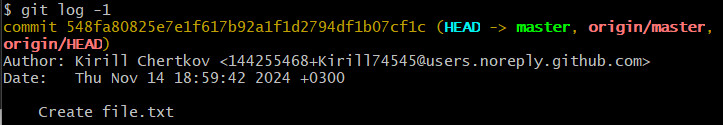
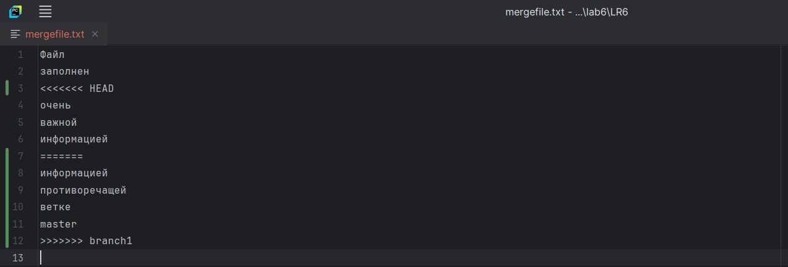
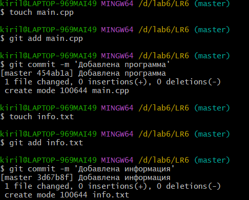
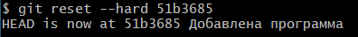

# LR6
Лабораторная работа №6

# Отчет по лабораторной работе GitHub

## 1. Создание аккаунта на сайте GitHub 
[Официальный сайт GitHub](https://github.com/)

## 2. Создание форка
*Скриншоты с созданием форка*  


## 3. Установка GitBush
[Установка Git](https://git-scm.com/)

## 4. Изменение имени пользователя
Команда для изменения имени пользователя:
```bash
$ git config --global user.name "Kirill Chertkov"
```

## 5. Клонирование репозитория
Команда для клонирования репозитория:
```bash
$ git clone https://github.com/Kirill74545/LR6/
```

*Скриншот с клонированием репозитория*  


## 6. Добавление нового файла, подтягивание изменений в локальный репозиторий
*Скриншот с добавлением нового файла через интерфейс GitHub*


Команда для подтягивания изменений:
```bash
$ git pull
```

*Скриншот с подтягиванием изменений в локальный репозиторий*


## 7. Получение данных для каждой из веток
Команда для получения данных для каждой из веток:
```bash
$ git log --all –oneline
```

*Скриншот с результатом получения данных из веток*


## 8. Просмотр последних изменений
Команда для просмотра последних изменений:
```bash
$ git log -1
```

*Скриншот с просмотром изменений*


## 9. Решение конфликта и слияние веток
Для решения конфликтов можно использовать специальные редакторы или графический интерфейс git

*Скриншот с решением конфликта в PyCharm*


Команда для слияния веток:
```bash
$ git merge branch1
```

## 10. Удаление побочной ветки после слияния
Команда для удаления побочных веток:
```bash
$ git branch -d branch1
```

*Скриншот с удалением побочной ветки*


## 11. Изменения, коммитация изменений
Команда для фиксирования изменений и их коммитации:
```bash
$ git add .
$ git commit -m 'Изменения'
```
*Коммитация изменений* 


## 12. Откат коммита
Команда для отката коммита:
```bash
$ git reset --hard 51b3685
```

*Скриншот с откатом коммита* 


## 13. Создание ветки для отчета
Команда для создания ветки:
```bash
$ git checkout -b report
```

*Скриншот с созданием ветки* 	


## 14. Получение истории операций в форматированном виде
Команда для получения истории операций в форматированном виде:
```bash
$ git log --pretty=format:"%h %ad %an %s" --date=short
```

## 15. История операций
Список истории операций:
+242fdd0 2024-11-14 Kirill Chertkov Добавлен отчет
+b9641f8 2024-11-14 Kirill Chertkov Добавлена папка со скринами
+51b3685 2024-11-14 Kirill Chertkov Добавлена программа
+747264c 2024-11-14 Kirill Chertkov Merge remote-tracking branch 'origin/branch1'
+548fa80 2024-11-14 Kirill Chertkov Create file.txt
+921f53b 2020-11-21 Kurtyanik Обновление информации
+0f9f50d 2020-11-21 Kurtyanik Заполнил файл
+c08a654 2020-11-21 Kurtyanik Файл создан пустым
+3c6e913 2020-11-21 Kurtyanik Initial commit

